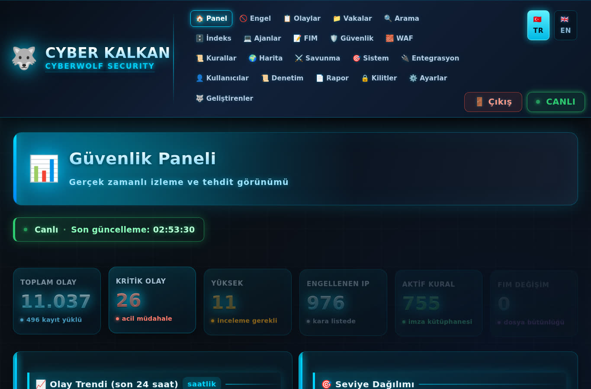
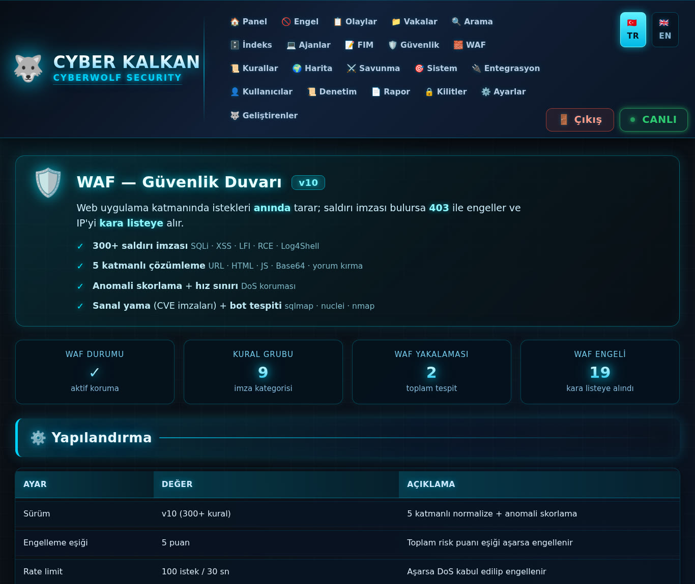
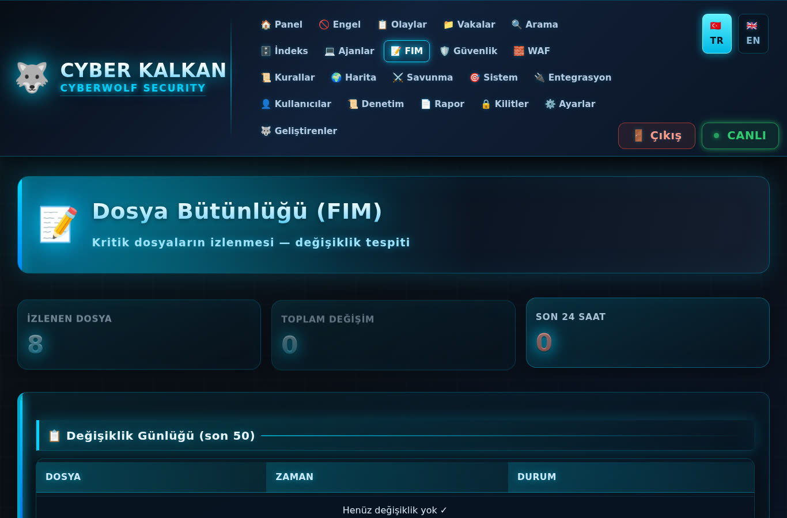
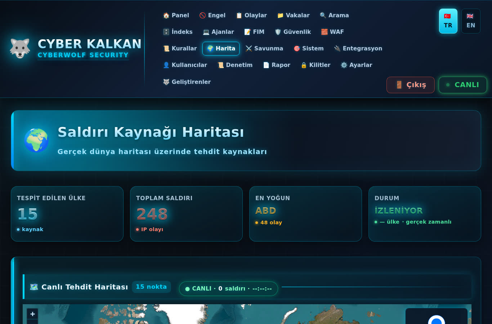

# 🐺 CYBER KALKAN — Siber Güvenlik Altyapısı v1.0

Tek sunucuda çalışan, kendi kendini koruyan **bütünleşik siber güvenlik platformu**.
Web uygulama güvenlik duvarından davranış analizine kadar 42 modül, 24 otomatik görev.

> **Kurulum bilgisi:** Geçici giriş — kullanıcı `admin` / şifre `kalkan`
> (ilk girişten sonra değiştirilmesi zorunludur)
>
> **E-posta bildirimi (isteğe bağlı):** `veri/mail_ayar.ornek.json` dosyasını
> `mail_ayar.json` olarak kopyalayıp **kendi** Brevo API anahtarını ve SMTP
> bilgilerini gir. Repoda gerçek anahtar yoktur — herkes kendininkini girer.

---

## 🎬 TANITIM VİDEOSU

**[▶ tanitim.mp4 — tüm modüller, müzikli](tanitim.mp4)**

20 modülün tamamını gezen hızlı tanıtım (3x hız): özet paneli → olay kayıtları
→ engellenen IP'ler → vakalar → arama → denetim izi → dosya bütünlüğü →
güvenlik durumu → WAF → kural kütüphanesi → coğrafya haritası → aktif savunma
→ sistem bilgisi → log indeksleyici → ajan yönetimi → kullanıcılar → kilitler
→ rapor → entegrasyon → geliştirenler.

---

## 📸 EKRAN GÖRÜNTÜLERİ

**[→ Tüm görüntüler ve açıklamaları: resimler/OKUBENI.md](resimler/OKUBENI.md)**

### Özet / Kontrol Paneli


### WAF — Güvenlik Duvarı


### Dosya Bütünlüğü (FIM)


### IP Coğrafya Haritası


---

## 📚 DOKÜMANTASYON

| Belge | İçerik |
|---|---|
| **[dokuman/MIMARI.md](dokuman/MIMARI.md)** | Katmanlı mimari · veri akışı · bileşenler · tasarım ilkeleri |
| **[dokuman/OZELLIKLER.md](dokuman/OZELLIKLER.md)** | 20 başlıkta tüm yetenekler, modül modül |
| **[dokuman/MODULLER.md](dokuman/MODULLER.md)** | 42 modülün teknik detayı |
| **[dokuman/KURULUM.md](dokuman/KURULUM.md)** | Adım adım kurulum · sorun giderme |

---

## 📊 SİSTEM GENEL BAKIŞ

| Katman | Teknoloji | Görev |
|---|---|---|
| Panel | PHP 8 + SQLite'siz JSON | 34 sayfa, TR/EN çift dil |
| Motor | Python 3 | 42 modül, 24 cron |
| WAF | PHP (kendi motoru) | 344 satır · 111 imza (20 kategori) |
| Firewall | nftables | kalıcı kara liste |
| IDS | Suricata | gerçek zamanlı imza |
| Servis | systemd | 7 birim, otomatik başlar |

```
┌─────────────────────────────────────────────────────────┐
│                    CYBER KALKAN v1.0                     │
├─────────────────────────────────────────────────────────┤
│  GİRDİ KATMANI                                          │
│   WAF (111 imza) → nftables → Suricata IPS              │
├─────────────────────────────────────────────────────────┤
│  ANALİZ KATMANI                                         │
│   Motor (korelasyon) · UEBA (davranış) · FIM (dosya)    │
│   Coğrafya (IP itibar) · Indexer (log) · Bulut (EVTX)   │
├─────────────────────────────────────────────────────────┤
│  SAVUNMA KATMANI                                        │
│   Aktif savunma (honeypot) · Honeyfile (tuzak)          │
│   Kimlik (RBAC/2FA) · Koruma (bütünlük)                 │
├─────────────────────────────────────────────────────────┤
│  UYUMLULUK KATMANI                                      │
│   Yedek (immutable) · Denetim (ISO/NIST/GDPR/PCI/CIS)   │
└─────────────────────────────────────────────────────────┘
```

---

## 🗂️ MODÜL LİSTESİ (42)

### Girdi / Ağ Güvenliği
| Modül | Dosya | Görev |
|---|---|---|
| **WAF** | `waf.php` | 111 imza (20 kategori), 5 katmanlı çözümleme, anomali skorlama, hız sınırı |
| **Firewall** | `kalkan_fw_v10.py` | nftables kara liste senkronu, kalıcılık |
| **IDS** | `kalkan_ids.py` | Suricata `eve.json` → otomatik engelleme |
| **Aktif Savunma** | `kalkan_aktif_v10.py` | 16 honeypot portu, püskürtme |

### Analiz
| Modül | Dosya | Görev |
|---|---|---|
| **Motor** | `kalkan_motor.py` | Kural motoru, olay korelasyonu, engel kararı |
| **UEBA** | `kalkan_ueba.py` | Davranış profili, beacon tespiti, 6 anomali eşiği |
| **FIM** | `kalkan_fim_v10.py` | 31 kritik dosya, SHA-256 baseline, değişim analizi |
| **Coğrafya** | `kalkan_cografya_v10.py` | Ülke + ASN + bulut/Tor risk skoru |
| **Indexer** | `kalkan_indexer_v10.py` | 6 log kaynağı, regex parse, korelasyon |
| **Bulut** | `kalkan_bulut_v10.py` | AWS/GCP/Azure denetimi + EVTX parse |

### Savunma
| Modül | Dosya | Görev |
|---|---|---|
| **Kimlik** | `kalkan_kimlik_v10.py` | RBAC, 2FA, oturum güvenliği, parola politikası |
| **Honeyfile** | `kalkan_honeyfile_v10.py` | 10 tuzak dosya, atime izleme |
| **Koruma** | `kalkan_koruma.py` | Kritik dosya bütünlüğü + onarım + yedek senkron |

### Tarama
| Modül | Dosya | Görev |
|---|---|---|
| **SCA** | `kalkan_sca_v10.py` | 48 CIS kontrol, kategori skorlama |
| **Zafiyet** | `kalkan_zafiyet_v10.py` | 20 CVE, CVSS, paket bazlı risk |
| **AV** | `kalkan_av_v10.py` | 20 imza, YARA, karantina, hash itibar |

### Uyumluluk
| Modül | Dosya | Görev |
|---|---|---|
| **Yedek** | `kalkan_yedek_v10.py` | Immutable yedek, SHA-256 doğrulama |
| **Denetim** | `kalkan_yedek_v10.py` | ISO 27001 · NIST CSF · GDPR · PCI DSS · KVKK |

---

## ⏱️ OTOMATİK GÖREVLER (24 cron)

| Sıklık | Görev |
|---|---|
| her dakika | WAF log, engel senkronu |
| her 2 dk | IDS → otomatik engelleme |
| her 5 dk | FIM dosya bütünlüğü, aktif savunma |
| her 10 dk | Motor korelasyon, honeyfile |
| her 15 dk | UEBA davranış, coğrafya |
| her 30 dk | Koruma yedeği senkronu |
| her 1 saat | SCA, indexer, bulut |
| her 6 saat | Zafiyet taraması, AV |
| günlük | Yedek, denetim, rapor |

---

## 🔐 GÜVENLİK ÖZELLİKLERİ

```
✓ 111 WAF imzası (SQLi · XSS · LFI · RCE · Log4Shell · Spring4Shell · NoSQL · SSTI)
✓ 5 katmanlı çözümleme (URL · HTML · JS · Base64 · yorum kırma)
✓ Anomali skorlama + hız sınırı (100 istek/30sn)
✓ Kalıcı engelleme (nftables, makine aç-kapa sonrası yüklenir)
✓ Otomatik IDS engelleme (Suricata alert → kara liste)
✓ Dosya bütünlüğü (SHA-256 baseline, 31 kritik dosya)
✓ Davranış analizi (UEBA, beacon tespiti)
✓ RBAC + 2FA + oturum kilidi
✓ Immutable yedek + onarım öncesi canlı kopya
✓ 5 uyumluluk çerçevesi denetimi
```

---

## 📁 KLASÖR YAPISI

```
sistem/
├── panel/          34 PHP sayfa + assets (CSS, JS, ikon)
├── motor/          42 Python modül + WAF (waf.php)
├── veri/           JSON veri deposu (kurallar, olaylar, engeller)
├── firewall/       nftables kuralları + yükleyici
├── servis/         systemd birimleri
└── dokuman/        bu dokümantasyon
```

---

## ⚙️ SERVİSLER

| Servis | Görev |
|---|---|
| `kalkan-panel` | Web paneli (127.0.0.1:8890) |
| `kalkan-motor` | Kural motoru döngüsü |
| `kalkan-fim` | Dosya bütünlüğü izleme |
| `kalkan-aktif` | Aktif savunma |
| `kalkan-honeyfile` | Tuzak dosya izleme |
| `kalkan-https` | stunnel (8443 TLS) |
| `suricata` | IDS |

---

## 📌 NOTLAR

- Panel **127.0.0.1:8890** üzerinde dinler; dış erişim HTTPS (8443) ile sağlanır.
- WAF, Cloudflare `CF-Connecting-IP` başlığını gerçek istemci olarak tanır.
- Tüm veri JSON dosyalarında tutulur (harici veritabanı yok).
- Çift dil desteği: Türkçe / İngilizce (kurulum anında seçilir).

---

## ⚠️ YASAL UYARI

Bu yazılım **yalnızca kendi sunucunuzu korumak** için tasarlanmıştır.
Başkasına ait sistemlerde izinsiz kullanım yasaya aykırıdır.

---

*CYBER KALKAN v1.0 · SİBER GÜVENLİK ALTYAPISI · 2026*
*🐺 CYBERWOLF SECURITY*# CYBER KALKAN — 05.10.2026
