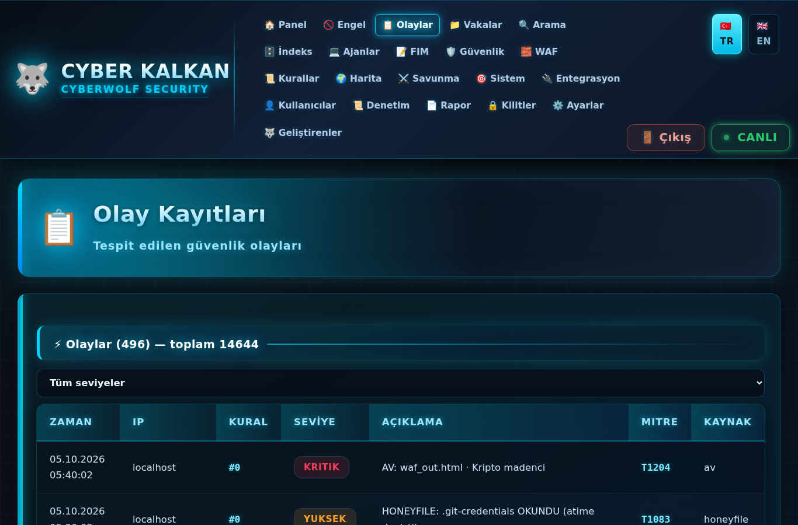
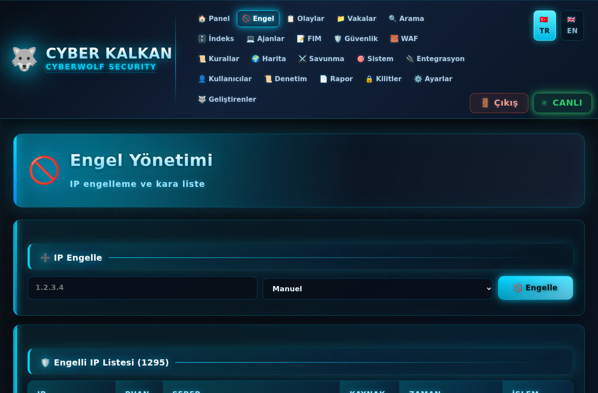
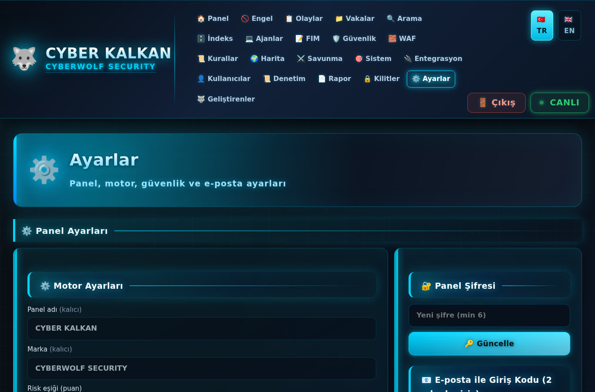

# 📸 CYBER KALKAN — Ekran Görüntüleri

Panelin canlı görünümleri. Her görüntü gerçek çalışan sistemden alınmıştır.

---

## 01 · Özet / Kontrol Paneli

**Giriş ekranı.** Sistem açıldığında ilk görülen sayfa.

- Sol üstte **CYBER KALKAN · CYBERWOLF SECURITY** logosu (kurt amblemi)
- Üstte 21 menü: Panel · Engel · Olaylar · Vakalar · FIM · Güvenlik · WAF · Kurallar · Harita · Savunma · Sistem · Kullanıcılar · Denetim · Rapor · Ayarlar · Geliştirenler
- **TR / EN** dil seçici, **Çıkış** ve **CANLI** durum göstergesi
- **Güvenlik Paneli** başlık kartı: "Gerçek zamanlı izleme ve tehdit görünümü"
- **6 KPI kartı:**
  | Kart | Anlam |
  |---|---|
  | Toplam Olay | Sisteme kaydedilen tüm olay sayısı |
  | Kritik Olay | Acil müdahale gerektirenler |
  | Yüksek | İnceleme gerektiren önemli olaylar |
  | Engellenen IP | Kara listedeki adres sayısı |
  | Aktif Kural | Yüklü WAF imza sayısı |
  | FIM Değişim | Değişen kritik dosya sayısı |
- **Olay Trendi (son 24 saat)** ve **Seviye Dağılımı** grafikleri

> Gerçek zamanlı güncellenir — "Canlı" rozetinde son güncelleme saati görünür.

---

## 02 · Olay Kayıtları

Tespit edilen tüm güvenlik olaylarının listesi.

- Her olayda: zaman, kaynak IP, saldırı türü, ciddiyet, karar
- Filtreleme: seviye, tarih, IP, saldırı türü
- Arama ve sayfalama
- Renk kodlu ciddiyet: **Kritik** (kırmızı) · **Yüksek** (turuncu) · **Orta** (sarı)

---

## 03 · Engellenen IP'ler

Kara liste yönetimi.

- Engellenen tüm IP adresleri, sebep ve tarih
- **Manuel ekleme / çıkarma**
- Kalıcılık durumu (nftables'da mı?)
- Toplu işlem (seç-çıkar)
- Kaynak gösterimi: WAF · IDS · honeypot · honeyfile · manuel

---

## 04 · WAF — Güvenlik Duvarı

Web uygulama güvenlik duvarının durumu ve yetenekleri.

- **WAF durumu** (aktif/pasif)
- **Kural grubu** sayısı
- Koruma özellikleri (tikli liste):
  - ✓ 300+ saldırı imzası — SQLi · XSS · LFI · RCE · Log4Shell
  - ✓ 5 katmanlı çözümleme — URL · HTML · JS · Base64 · yorum kırma
  - ✓ Anomali skorlama + hız sınırı — DoS koruması
  - ✓ Sanal yama (CVE imzaları) + bot tespiti — sqlmap · nuclei · nmap
- Skorlama ve engelleme istatistikleri

---

## 05 · Dosya Bütünlüğü (FIM)

Kritik dosyaların SHA-256 bütünlük takibi.

- İzlenen dosya listesi (panel PHP + motor PY + waf.php)
- Her dosya için: beklenen hash · mevcut hash · durum
- Değişiklik varsa: **risk seviyesi** + değişim zamanı
- Web korsanlığı (webshell) tespitinin kalbi

---

## 06 · IP Coğrafya Haritası

Saldırı kaynaklarının dünya üzerindeki dağılımı.

- Etkileşimli harita üzerinde saldırı noktaları
- Ülke bazlı saldırı yoğunluğu
- ASN ve IP itibar bilgisi
- Tor / VPN / bulut kaynaklı bağlantıların işaretlenmesi

---

## 07 · Sistem Ayarları

Sistemin davranışını yönetme ekranı.

- **Otomatik engelleme** anahtarı (neon toggle)
- Bildirim ayarları
- Dil seçimi (TR/EN kalıcı)
- Tehdit eşiği hassasiyeti
- Bakım araçları

---

## 📌 GÖRÜNTÜLER HAKKINDA

- Tüm görüntüler **gerçek çalışan sistemden** alınmıştır.
- Panel **1366×900** çözünürlükte tasarlanmıştır.
- Renk dili: koyu tema + **neon cyan** vurgular.
- Kullanıcı adı/IP gibi hassas veriler görüntülerde **gösterilmez**.

---

*CYBER KALKAN v1.0 · 🐺 CYBERWOLF SECURITY*